# BMA_BestServices

## Objective:
The objective of this project is to design and develop an Internal Control Adequacy Assessment questionnaire system using the Django framework. The system will comprise 58 questions organized into four distinct sections. The primary goals are to:

Create a user-friendly questionnaire system for assessing internal control adequacy within an organization.
Implement a weighted average formula to calculate the scores for each question within their respective sections.
Generate summary metrics (Excellence, Fair, and Poor) for each section based on the calculated scores.
Utilize Matplotlib to visualize and present the assessment results through a Bar Chart, providing an intuitive overview of the internal control adequacy.

## Definition:
The project involves the development of an Internal Control Adequacy Assessment questionnaire system, designed and built using the Django web framework. This system is intended to evaluate the effectiveness and adequacy of an organization's internal controls.

Key components and features of the system include:

Questionnaire System: The system will include a user interface allowing users to answer 58 questions. These questions are categorized into four sections, making it comprehensive and structured.

Weighted Average Formula: Each question within the sections will have a specific weight, and a weighted average formula will be implemented to compute scores. This formula ensures that the significance of each question is considered in the overall assessment.

Sectional Metrics: The system will generate summary metrics for each section, categorizing them into three levels of assessment: Excellence, Fair, and Poor. This will provide a clear and concise overview of the adequacy of internal controls within each section.

Matplotlib Integration: Matplotlib, a Python library for data visualization, will be used to create a Bar Chart. This chart will summarize the assessment results, making it easier for stakeholders to interpret and compare the internal control adequacy of different sections.

## Tools:
The web application has been developed for internal use across multiple divisions within the organization, allowing easy access through BMA's internal localhost. It is constructed using Python, Django framework version 3, and MySQL, with a straightforward combination of HTML, CSS, and JavaScript.

## Screenshots

The system is accessible to all organization members through the organization's local network. First section, the questionnaire will prompt users to provide basic information regarding their role and department.

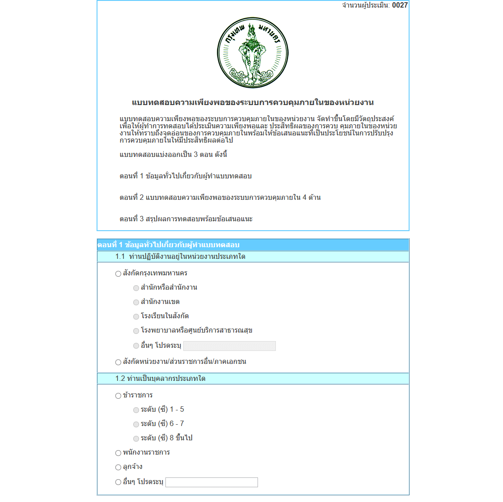

The second section consists of a questionnaire comprising 58 questions, which organized into four subsections, each related to the Adequacy Assessment.

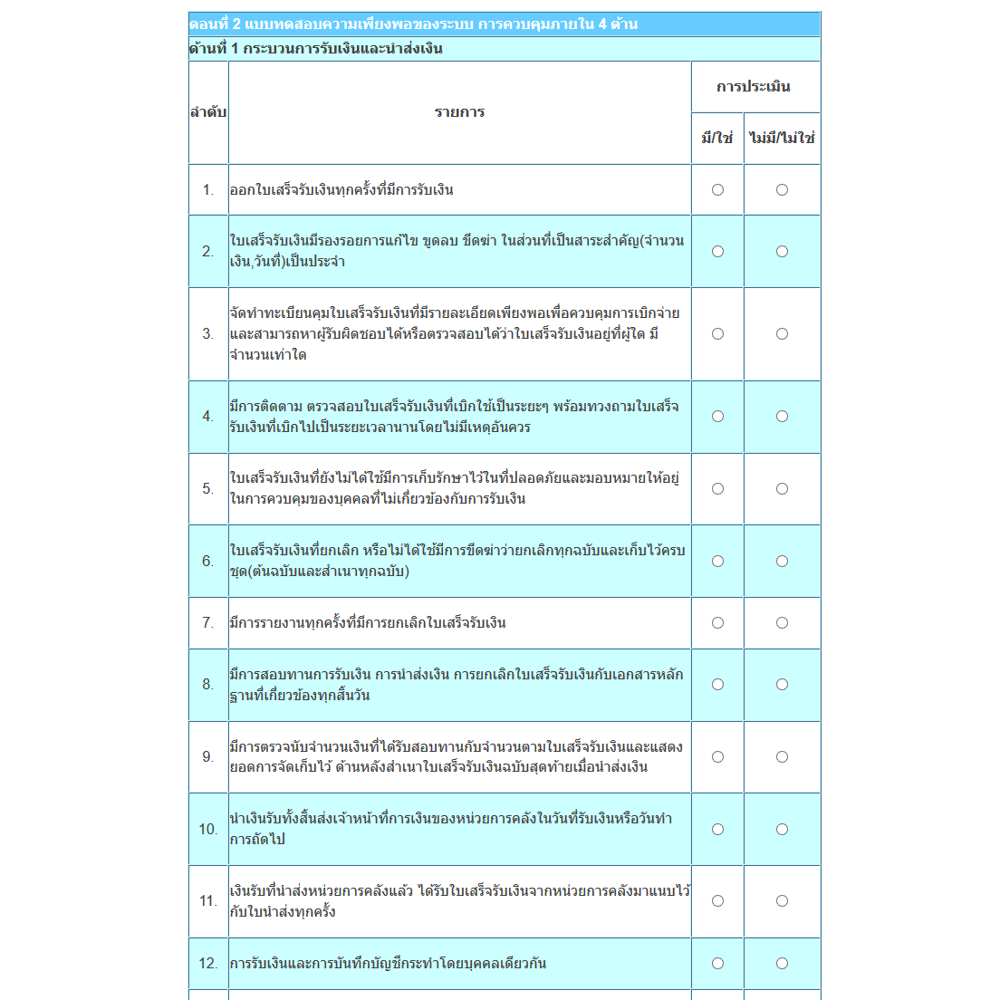

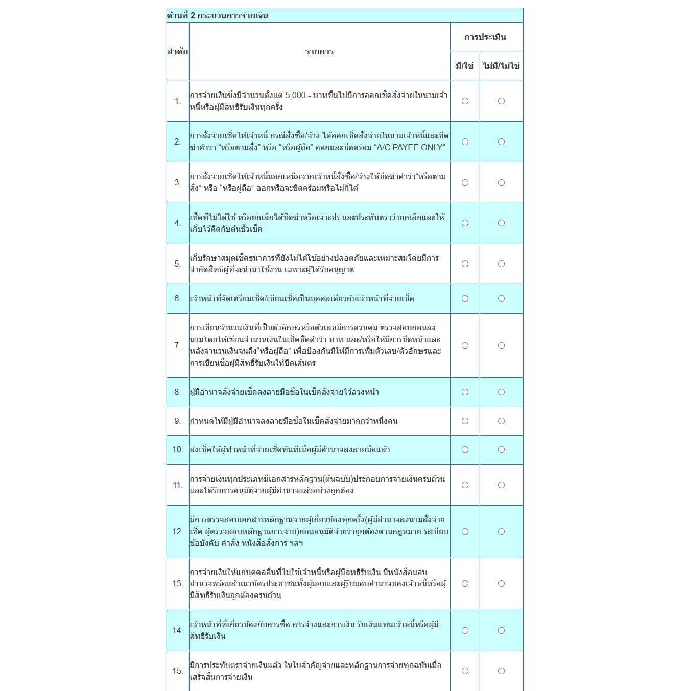

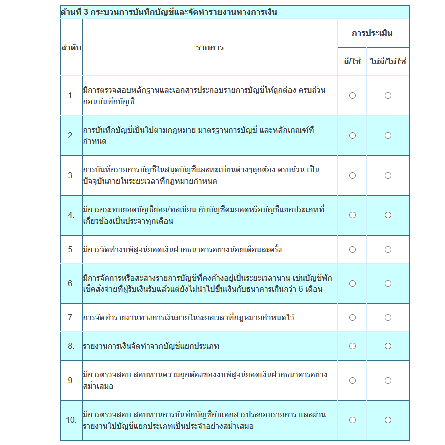

The third section involves implementing a weighted average formula for each question within its respective category to generate summary metrics, which categorize the section's performance as either Excellence, Fair, or Poor.

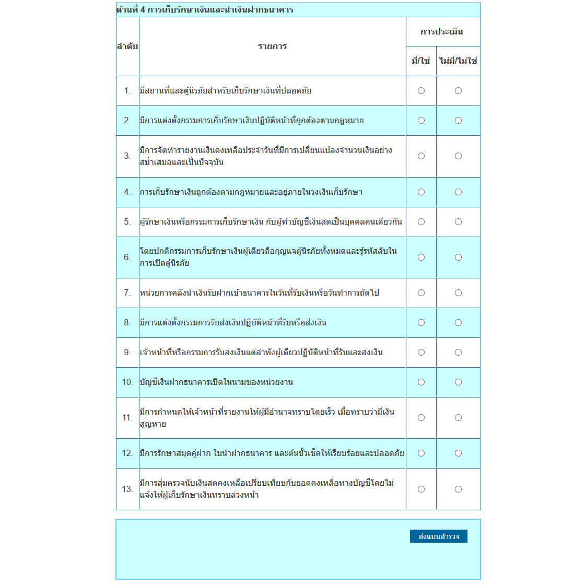

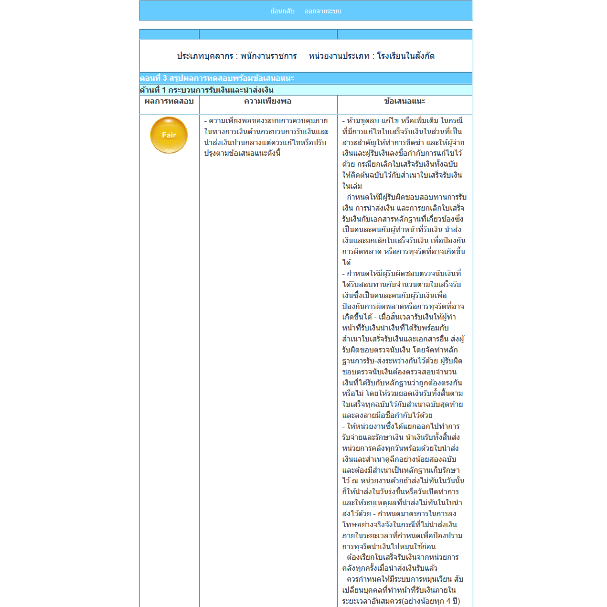

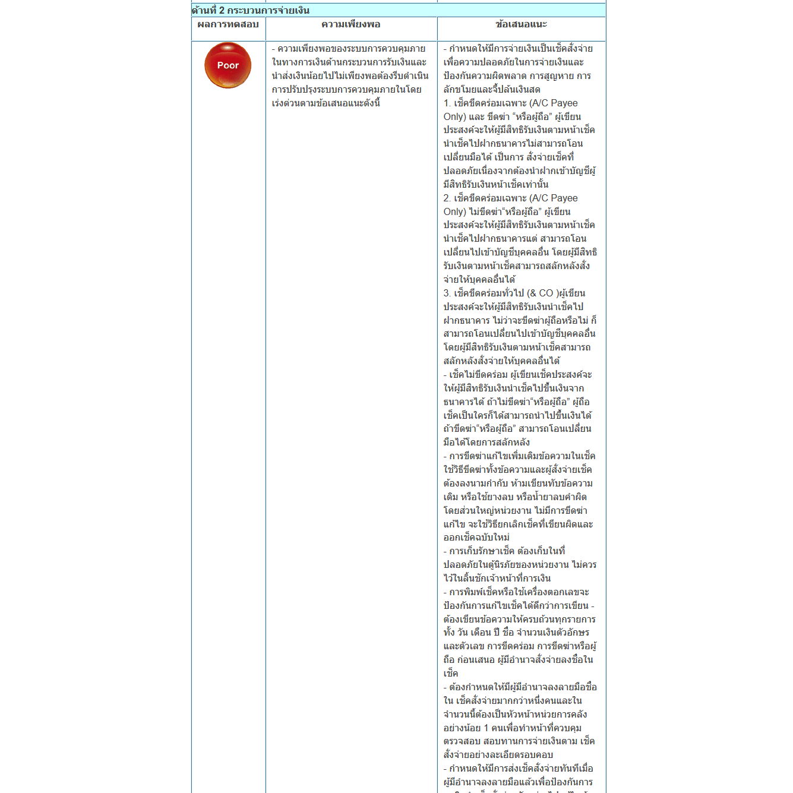

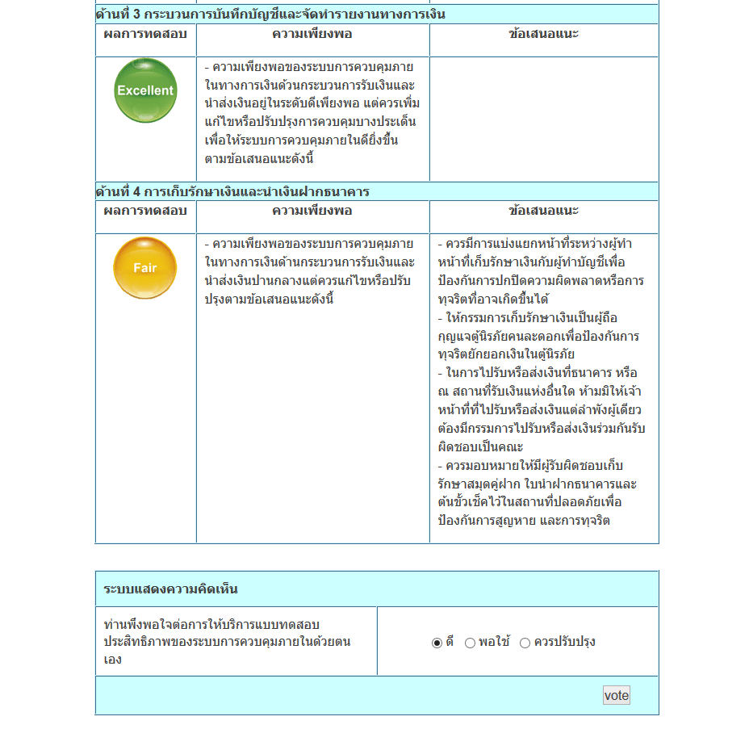

Creating a concluding summary involves utilizing Matplotlib to generate a Bar Chart that encapsulates and highlights the comprehensive assessment results.

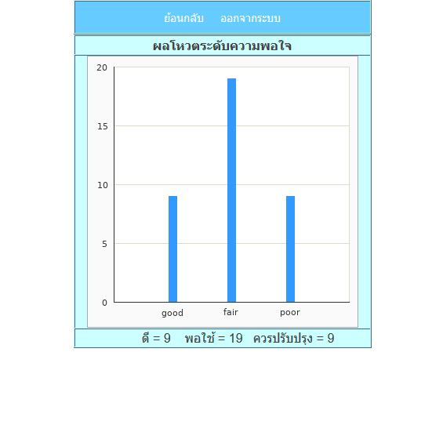

The administrative section has the capability to access results, allowing them to assess how each officer within their organization has responded to the Internal Control Adequacy Assessment in various questionnaire sections. Furthermore, they have the ability to perform queries on results based on specific months and years.

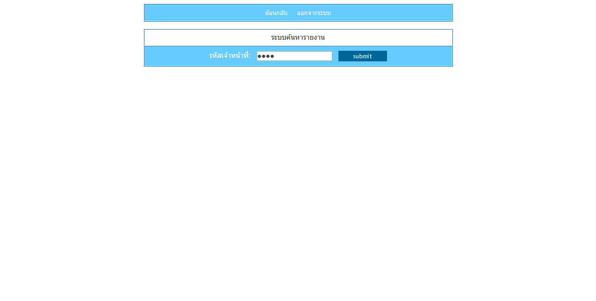

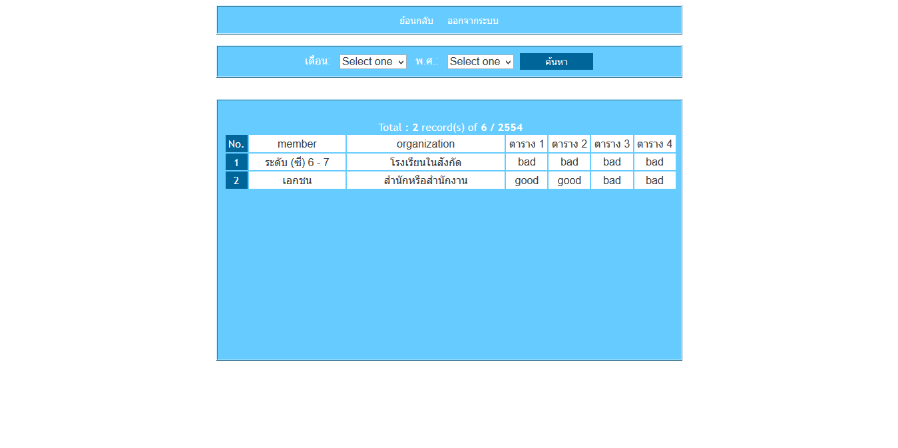

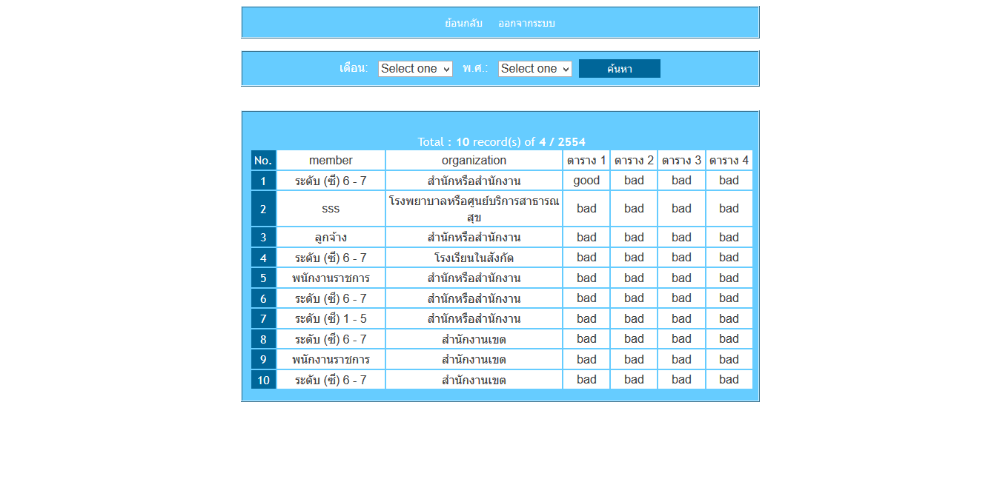
