# BMA_MOnline

## Objective:
The objective of this project is to design and develop M-Online, a JAVA-based internal audit login system, with a comprehensive user management system that assigns roles based on departmental positions. The system will comprise four distinct subsystems: Officer Management System, Audit Report Management System, Report Generator, and Report Download/Upload System.

## Definition:
M-Online is a JAVA-based internal audit login system that aims to streamline and enhance the internal audit processes within an organization. The system includes the following key features and subsystems:

Officer Management System:

This subsystem enables the management of user accounts and roles within the M-Online system.
Users are assigned specific roles based on their departmental positions, ensuring the right level of access and permissions.
Audit Report Management System:

The Audit Report Management System (We refer to the audit report document as "M.") allows users to record audit issues efficiently.
Users have the ability to attach relevant documents in customizable text and paragraph formats to provide comprehensive audit documentation.
This subsystem streamlines the process of issue recording, tracking, and management.
Report Generator:

The Report Generator is designed to consolidate approved audit reports efficiently.
It allows users to create topic-specific reports by compiling data from the Audit Report Management System.
The generated reports are formatted for easy readability and can be converted into printable PDF documents.
Report Download/Upload System:

The Report Download/Upload System facilitates the seamless upload and download of audit reports.
Users can easily upload generated reports, making them accessible to higher-level authorities for review and approval.
Approved reports can be downloaded in PDF format for documentation and distribution.

## Tools:
The web is built as portal of sub system based on Java SE 6/7, Spring framework 3, and MySQL with hibernate 3/4

## Screenshots

Firstpage is an authentication system that assigns roles based on the actual responsibilities of officers. This system grants users specific permissions to interact with various functions within any subsystem, aligning access with the officers' real roles and responsibilities.

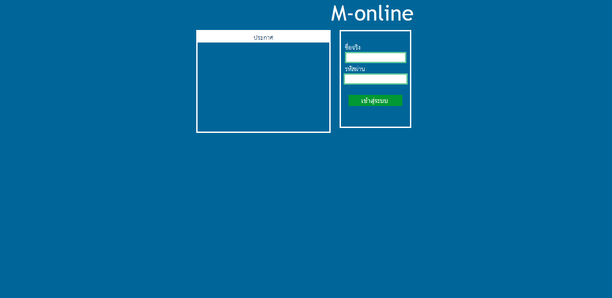

Users with an admin role will have access to all subsystems.

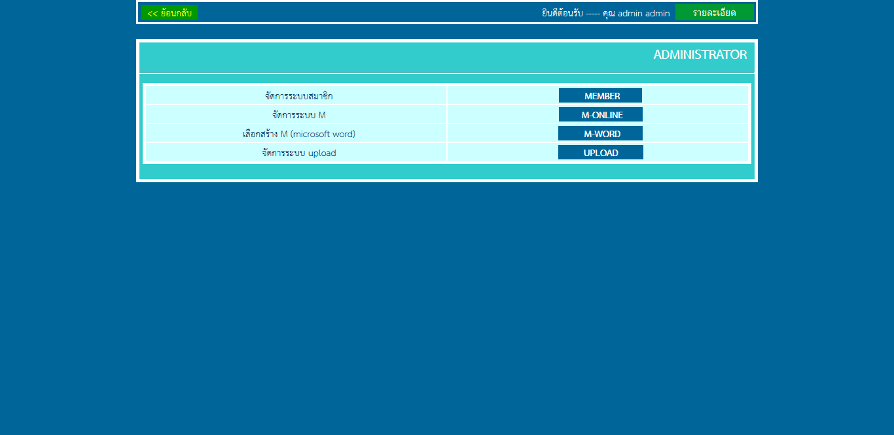

Member management panel

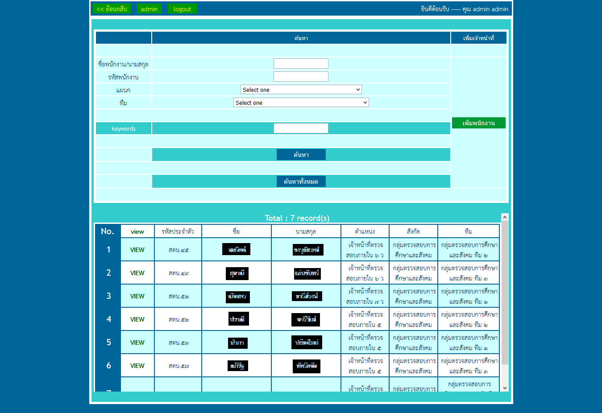

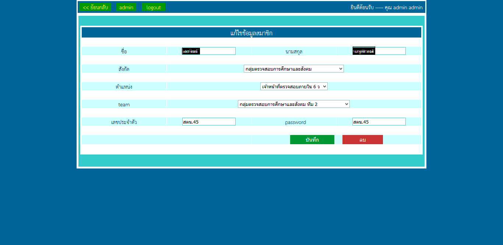

The Audit Report Management Creation System (M)

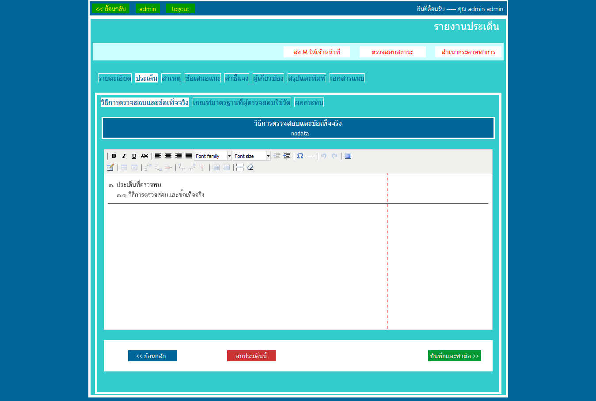

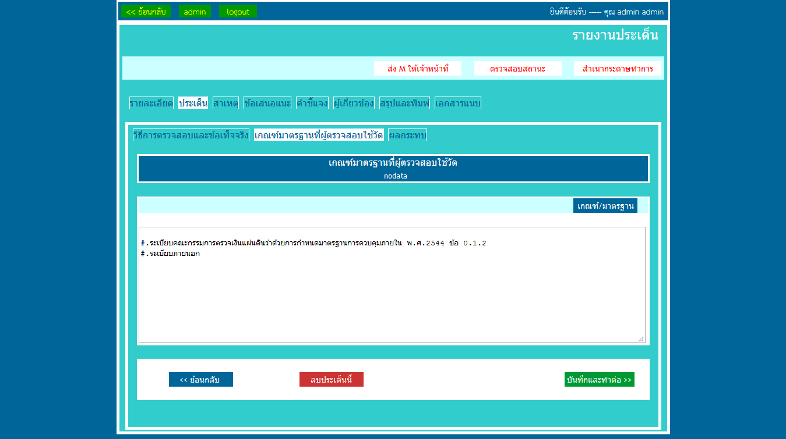

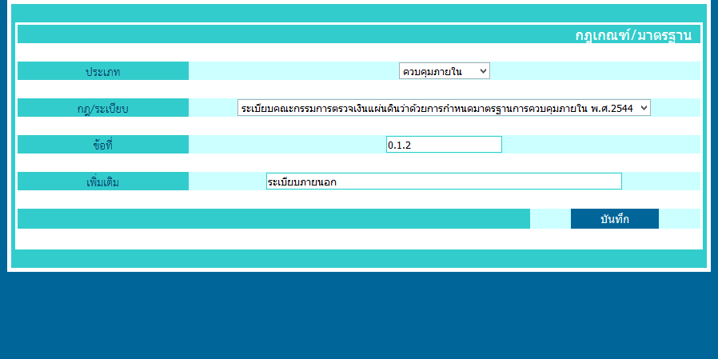

Merge relevant M in to one word file then the completed M will be converted to PDF

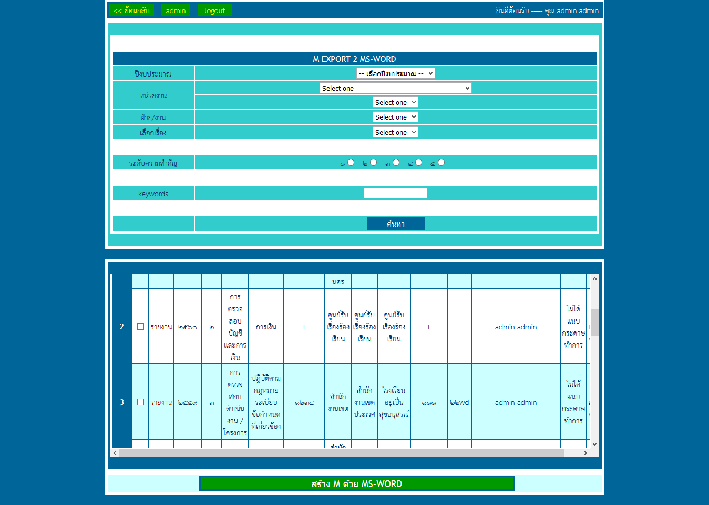

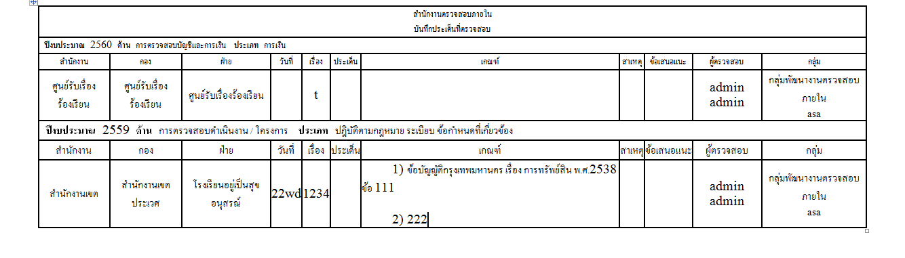

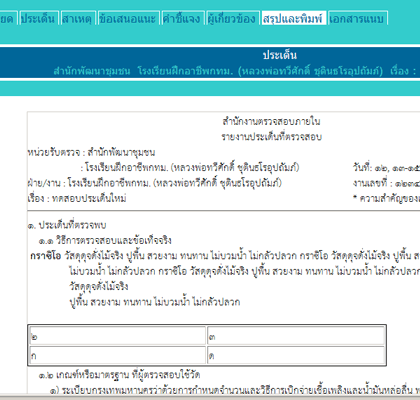

The Report Download/Upload System

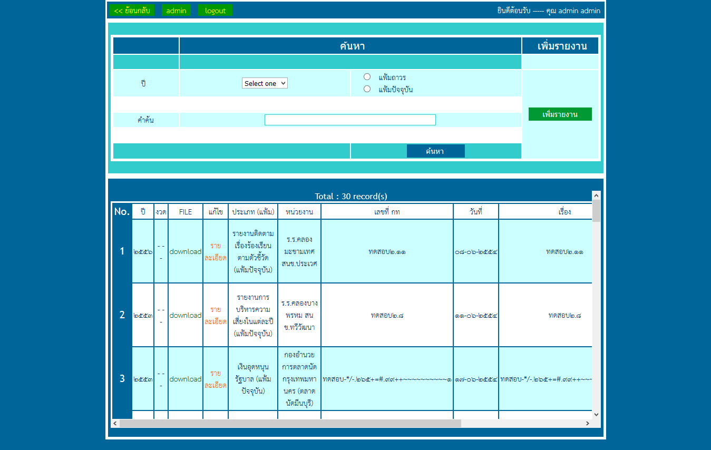

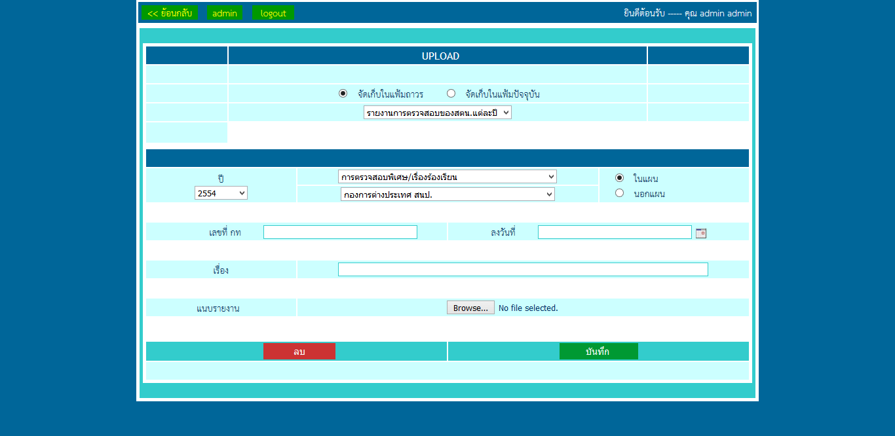

