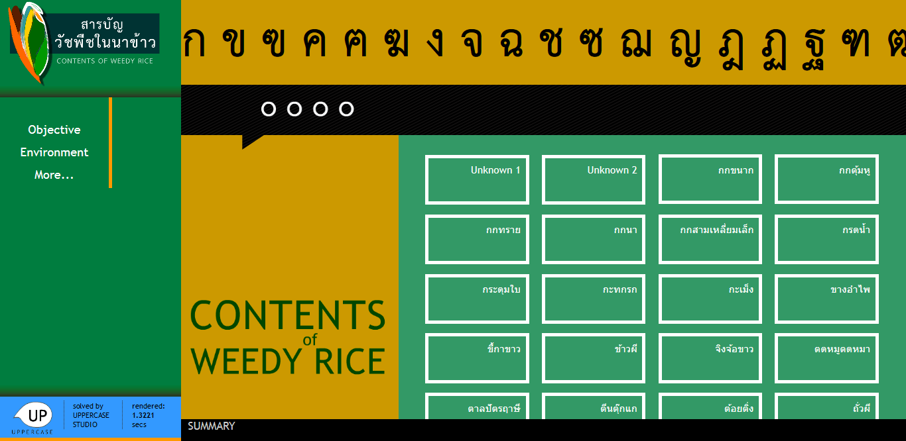
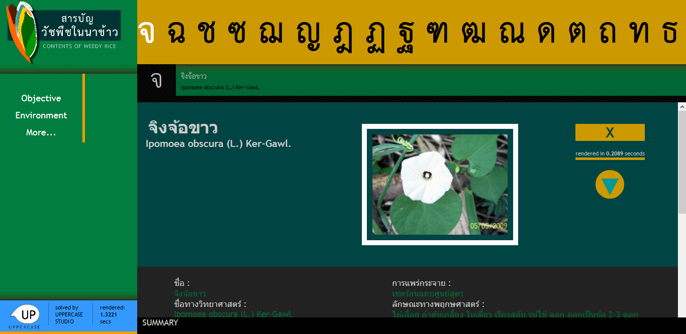
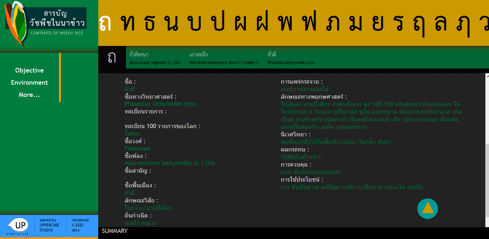
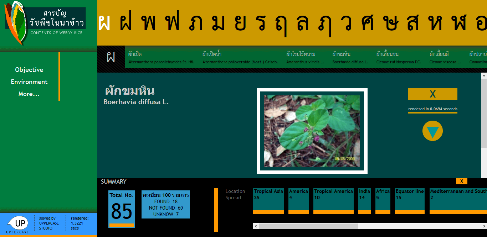

# ContentOfWeedyRices

Collection of tropical weedy rice sorted by Thai alphabet.

## Objective:
The objective of the ContentOfWeedyRices Collection is to provide a comprehensive and organized repository of tropical weedy rice varieties, sorted by the Thai alphabet. This collection aims to serve as an educational resource, facilitating easy access to valuable information about weedy rice for academic and research purposes.

## Definition:
The ContentOfWeedyRices Collection is a curated compilation of tropical weedy rice specimens, systematically organized according to the Thai alphabet. This collection is established with the primary intention of being a Special Purpose Application (SPA), ensuring user-friendliness and accessibility. It serves as an educational platform, offering valuable insights into the world of weedy rice, including its various varieties, characteristics, and relevant information, with the goal of promoting learning, research, and knowledge sharing in this field.

## Tools:
The web is built as a Single Page Application (SPA) using Python, Django, and React.js

## Screenshots

The initial page contains an ordered list of the Thai alphabet and a comprehensive collection of weedy rice varieties in the main section. Users have the option to choose a specific weedy rice variety directly or select one by using the Thai alphabet. You can easily navigate through the alphabet list by sliding until you reach the last letter.

When a specific alphabet is chosen, all the weedy rices corresponding to the selected letter will be displayed in a list. The user can then make a selection from this list, and detailed information about the chosen weedy rice will be presented in the main section.

Users can also access summaries and statistics for all weed-related incidents in the summary section.

